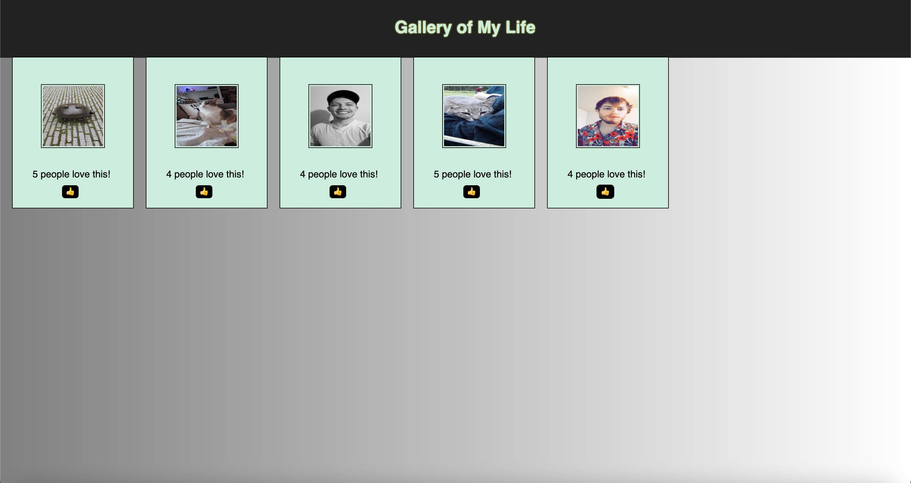

# PROJECT NAME
Weekend-react-gallery
## Description
This project took between 10-15 hours to complete. 
I referenced old projects and did a lot of googling to put this together,
and I am happy with the result. It isn't anything pretty but it serves as
a great template for future projects.

The biggest problem was deciding how to go about switching the images from
the image to the description on click. I opted to change it from an onClick
event to a onMouseOver and onMouseOut. Otherwise the use would be confused and wouldn't realize they'd need to click on the description text in order to see the image again. 

## Screen Shot

### Prerequisites

-Git- https://git-scm.com/
-Github- https://github.com/SirChristianWilliam
-Javascript- https://www.javascript.com/
-Jquery- https://jquery.com/
-HTML- https://www.w3schools.com/html/
-CSS- https://www.w3schools.com/css/
-Node - [Node.js](https://nodejs.org/en/)

## Installation

Make sure to install npm!

## Usage
Users can use this template and add their own images to create their own image gallery. As of now, there is no limit on the amount of likes you can give an image, but could easily be remedied with a conditional. Move your cursor over the images to see their descriptions, and move it away to revert back to the image itself. The like button below will increase the number of likes, on click. 

## Acknowledgement
Thanks to [Prime Digital Academy](www.primeacademy.io) who equipped and helped me to make this application a reality.

## Support
If you have suggestions or issues, please email me at [chrismaki123@gmail.com]